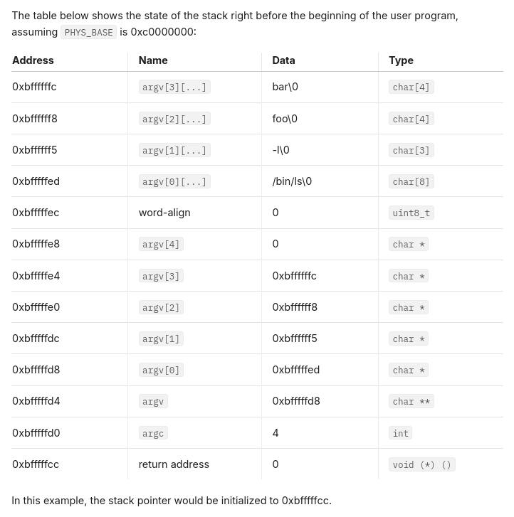

# 80x86 Calling convention

The following summarizes the process of calling a function in 32-bit UNIX implementation:

- The caller pushes each argument from right to left in the stack. Similar to the C expression
  `*--sp=arg[i]`
- The `CALL` does the following:
  - Push the "return address" (the address of the instruction following the call) onto the stack.
  - Jump to the first instruction of the callee.
- The callee executes with the SP (Stack Pointer) set to the return address, so its first
  argument is right above, the second is above that, and so on.
- If the callee returns, its return value its stored in the `EAX` register.
- The callee returns by popping the return address from the stack and jumping to the location
  it specifies using the `RET` instruction.

This diagram illustrates the stack after calling the function `f(1, 2, 3)`:

```txt
                             +----------------+
                  0xbffffe7c |        3       |
                  0xbffffe78 |        2       |
                  0xbffffe74 |        1       |
stack pointer --> 0xbffffe70 | return address |
                             +----------------+
```

## Argument passing

Of course the example above is easy to grasp, but in a real program (as defined by the C standard)
arguments are passed as strings.

For example, for the `ls -la foo bar` command the process would be:

- The argument is broken into individual strings: `ls`, `-la`, `foo`, `bar`.
- The strings (plus a NULL terminator sentinel) are pushed onto the stack.
  The orden doesn't really matter.
- The address of those strings will be pushed from right-to-left order. This will be the values
  of `argv`. A null sentinel will be placed at the top of them, so that `argv[argc]` is NULL,
  as required by the C standard.
- Then push `argv` (the address of `argv[0]`), `argc`, and the return address, in that order.



As you can see the return address is actually a fake one. This is because the `main` function
will never return to that address. We leave that address there to be consistent.

```txt
bfffffc0                                      00 00 00 00 |            ....|
bfffffd0  04 00 00 00 d8 ff ff bf-ed ff ff bf f5 ff ff bf |................|
bfffffe0  f8 ff ff bf fc ff ff bf-00 00 00 00 00 2f 62 69 |............./bi|
bffffff0  6e 2f 6c 73 00 2d 6c 00-66 6f 6f 00 62 61 72 00 |n/ls.-l.foo.bar.|
```

## System calls

In the project 1 we dealt with "external" system calls like timer interrupts and keyboard input.

Now we need to deal with "internal" interrupts like:

- `int 0x30` for system calls.
- Exceptions like page faults, divide by zero, etc.

Before calling a system calls the needed arguments are pushed onto the stack along with the
system call number. The `int 0x30` instruction is then executed. All the arguments are of
a fixed size (4 bytes). You can take advantage of this to pop the arguments from the stack
in reverse order.

If the system call returns a value, it will be stored in the `EAX` register. This is by modifying
the `eax` member in the `struct intr_frame`.
