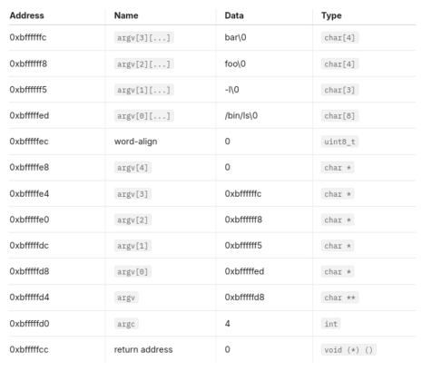

<!-- markdownlint-disable MD033 MD024 MD041 -->

<div align="center">

<h2>Project 2: User Programs</h2>

Operating Systems — National University of San Marcos

</div>

### Group

- Damaris Del Carpio [damaris.delcarpio@unmsm.edu.pe](mailto:damaris.delcarpio@unmsm.edu.pe)
- Paolo Flores [paolo.flores2@unmsm.edu.pe](mailto:paolo.flores2@unmsm.edu.pe)

### Preliminaries

> Please cite any offline or online sources you consulted while
> preparing your submission, other than the Pintos documentation, course
> text, lecture notes, and course staff.

1. PintOS Project 2 Introduction. <https://www.youtube.com/watch?v=RbsE0EQ9_dY>
2. System Calls Introduction by University of Toronto. <https://www.youtube.com/watch?v=jfPdiaAG0AQ> <https://www.youtube.com/watch?v=3DcNBOUkXuw>
3. <https://pkuflyingpig.gitbook.io/>
4. Operating Systems: Principles and Practice (Anderson and Dahlin)
5. <https://en.wikipedia.org/wiki/Memory_paging#Physical_and_virtual_address_space_sizes>

## Argument Passing

### Data Structures

> **A1:** Copy here the declaration of each new or changed `struct` or
> `struct` member, global or static variable, `typedef`, or
> enumeration.  Identify the purpose of each in 25 words or less.

None.

### Algorithm

> **A2:** Briefly describe how you implemented argument parsing.  How do
> you arrange for the elements of argv[] to be in the right order?
> How do you avoid overflowing the stack page?

**1. Command Parsing:**

First we tokenize the command-line string into command (argv[0]) and arguments (argv[1..n])
into two variables: `cmd` and `argv` respectively using `strtok_r()`.

```c
// File: userprog/process.c
int
process_parse_args (char *cmd, char **argv)
{
  int argc = 0;
  char *token, *save_ptr;

  for (
    token = strtok_r (cmd, " ", &save_ptr);
    token != NULL;
    token = strtok_r (NULL, " ", &save_ptr), argc++
  )
    argv[argc] = token;

  return argc;
}
```

**2. Stack Initialization:**

Once we have the command and arguments, we push them onto the stack of the
calling process.

This process follows the standard x86 calling convention:

- Pushes arguments data.
- Aligns memory to 4 bytes.
- Pushes the address of the arguments in right-to-left order.
- Pushes the address of `argv[0]`.
- Pushes argc.
- Pushes a fake return address (0).

For example, the command arguments for `/bin/ls -l foo bar` would be pushed
to the stack as:



```c
// File: userprog/process.c
void
process_init_stack_args (char **argv, int argc, void **esp)
{
  //....

  // And we push the pointers one by one, in reverse order
  for(int i = argc - 1; i >= 0; i--)
    {
      *esp -= 4;
      **(uint32_t **)esp = argv[i];
    }

  //....
}
```

The stack is managed by setting up the stack page at the top of the user
virtual memory (`PHYS_BASE`) and adjusting the stack pointer (`esp`) accordingly.

We ensured that the stack grows downwards, however, we didn't provide overflow
checks for the allocated page and assume 4KB is enough for most use cases.

### Rationale

> **A3:** Why does Pintos implement `strtok_r()` but not `strtok()`?

Pintos uses `strtok_r()` because it is a safer and more flexible version of `strtok()`.

The key difference is that `strtok_r()` requires the caller to provide a separate
pointer (`save_ptr`) to keep track of the current position in the string,
while `strtok()` stores this information internally (i.e., globally).

For example, if two threads were to call `strtok()` simultaneously, they would
share the same internal pointer and could interfere with each other, leading
to very hard to debug errors like memory corruption or undefined behavior.

> **A4:** In Pintos, the kernel separates commands into a executable name
> and arguments. In Unix-like systems, the shell does this
> separation. Identify at least two advantages of the Unix approach.

1. Reduces the kernel's workload: In the Unix approach, the shell,
   which runs in user space, handles command parsing. This separation of
   concerns offloads this responsability to the kernel, making it simpler.

2. Improves flexibility: Individual shell implementations can have
   different parsing rules, or mechanisms, allowing for more customization
   without affecting the kernel. Thanks to this we users benefit from
   features like wildcards, pipes, and redirection.

3. Platform independence: Because Unix is a standard, this separation
   of concerns provide a consistent interface across different Unix systems.

## System Calls

### Data Structures

> **B1:** Copy here the declaration of each new or changed `struct` or
> `struct` member, global or static variable, `typedef', or
> enumeration.  Identify the purpose of each in 25 words or less.

#### Parent-child Relatioinship

```c
//File: threads/thread.h
struct thread {
  #ifdef USERPROG
      /* Owned by userprog/process.c. */
      // ...
      struct thread *parent_process;
      struct list list_child_process;
      struct list_elem elem_child_process;
  #endif
  // ...
}
```

Fields in struct thread track parent-child process relationships, storing the
parent in parent_process and child processes in list_child_process, initialized
during thread_create.

#### Process control block

Now that we support user processes, we needed to store process information
like open files, state semaphores, exit status, etc. somewhere. For this purpose
Operating systems use a structure called the Process Control Block (PCB).

```c
struct pcb
  {
    int exit_code;   // Initial value is -1
    bool has_exited;
    bool has_loaded;

    struct file **fd_table; // File descriptor table
    int fd_count;           // Number of file descriptors
    struct file *exec_file; // A reference to the opened executable
                            // of the process

    struct semaphore sema_wait; // Waiter for the process to finish
    struct semaphore sema_load; // Waiter for the process to be loaded
  };
```

In the future, this structure could be expanded to include more process
information like pid, privilegies, limits, etc.

> **B2:** Describe how file descriptors are associated with open files.
> Are file descriptors unique within the entire OS or just within a
> single process?

File descriptors are only unique within each process and are assigned as non-negative
integers to open files. File descriptors 0 and 1 are for standard input and output.
Each process has its own file descriptor table `fd_table` for this purpose.

File descriptors are not unique across the entire OS.

### Algorithms

> **B3:** Describe your code for reading and writing user data from the
> kernel.

`sys_read (fd, buffer, size)`:

- Argument validation: It checks if the provided buffer address is valid using
  `is_valid_uaddr ()`. If not, exits the process.

- It retrieves the associated file descriptor (`fd`) from the thread's file descriptor table. If
  it's not there or it's invalid, exists.

- Read: It acquires the `file_lock` lock to ensure synchronization while reading.
  The `file_read ()` function provided by Pintos is used to read the specified number
  of bytes (size) from the file into the provided buffer.

- The lock is released.

- The number of bytes actually read from the file is returned.

`sys_write (fd, buffer, size)`:

- It checks if the file descriptor (`fd`) is valid and within range, otherwise, exits.

- If `fd` == 1 (standard output), it directly writes to the console using `putbuf()`.
  Otherwise, it retrieves the file from the file descriptor table.

- The function locks access to the file and performs the write using `file_write ()` provided by Pintos.

- The lock `file_lock` is released.

- The number of written bytes is returned.

> **B4:** Suppose a system call causes a full page (4,096 bytes) of data
> to be copied from user space into the kernel.  What is the least
> and the greatest possible number of inspections of the page table
> (e.g. calls to pagedir_get_page()) that might result?  What about
> for a system call that only copies 2 bytes of data?  Is there room
> for improvement in these numbers, and how much?

For a system call copying 4096 bytes (a full page), the least possible number
of page table inspections is 1, assuming the entire page is already mapped in
memory and continuous. The greatest theoretically number is 4096, with each
byte requiring a call to `pagedir_get_page`.

The same logic applies to a system call copying 2 bytes, with the least number
being 1 and the greatest being 2.

Room for improvement exists by, instead of translating addresses and parsing
pages on the fly, we first determine the page address range so we can do
inspection in batches. For example, one inspection for aligned pages.


> **B5:** Briefly describe your implementation of the "wait" system call
> and how it interacts with process termination.

The function waits for the specified child process (identified by pid) to
terminate. It calls `process_wait (pid)`, which is responsible for handling
the termination process.

The `process_wait ()` function:

- first checks if the child exists and whether it is a valid child process.
  If the process is invalid or has already been waited on, it returns -1.

- it uses a semaphore (`sema_wait` in PCB) to wait until the child process has terminated.

- Once the child process exits, its exit status is retrieved, and the child process's
  resources are cleaned up.

> **B6:** Any access to user program memory at a user-specified address
> can fail due to a bad pointer value.  Such accesses must cause the
> process to be terminated.  System calls are fraught with such
> accesses, e.g. a "write" system call requires reading the system
> call number from the user stack, then each of the call's three
> arguments, then an arbitrary amount of user memory, and any of
> these can fail at any point.  This poses a design and
> error-handling problem: how do you best avoid obscuring the primary
> function of code in a morass of error-handling?  Furthermore, when
> an error is detected, how do you ensure that all temporarily
> allocated resources (locks, buffers, etc.) are freed?  In a few
> paragraphs, describe the strategy or strategies you adopted for
> managing these issues.  Give an example.

The strategy to handle errors due to bad pointer values in system calls involves
two key elements: validation and cleanup.

Every user-specified memory address is checked for validity using the
is_valid_uaddr function, ensuring it lies within the allowed user space range.
Invalid addresses immediately trigger a process termination using sys_exit.
To manage error handling cleanly and avoid cluttering the main logic,
validation is modularized into helper functions like get_syscall_args.
These helpers centralize checks and reduce repetition, maintaining code clarity.

For resource management, temporarily allocated resources such as locks or
buffers are managed using structured approaches. For instance, file operations
use the file_lock to ensure consistent state, and the lock is always released
after an operation—whether successful or not. Similarly, open file descriptors
are tracked in a process's fd_table, and resources are released systematically
when errors occur or during process termination.

As an example, in the sys_open function, memory validation ensures the
provided filename is valid. If validation fails, the function exits immediately,
avoiding partial resource allocation. When file operations succeed, the lock
ensures thread safety, and proper bookkeeping is done to update the fd_table.

### Synchronization

> **B7:** The "exec" system call returns -1 if loading the new executable
> fails, so it cannot return before the new executable has completed
> loading.  How does your code ensure this?  How is the load
> success/failure status passed back to the thread that calls "exec"?

The `sys_exec ()` function ensures that the new executable has been successfully
loaded before returning by leveraging the `has_loaded` flag in the Process Control
Block (PCB). After calling `process_execute(cmd_line)`, I check the `has_loaded`
field of the child process's PCB. If the executable fails to load (i.e., has_loaded
is false or pid is -1), `sys_exec ()` returns -1. This ensures that the function
only returns a valid process ID when the executable has been properly loaded.
The parent waits for the child process to load, synchronizing the execution flow.

> **B8:** Consider parent process P with child process C.  How do you
> ensure proper synchronization and avoid race conditions when P
> calls wait(C) before C exits?  After C exits?  How do you ensure
> that all resources are freed in each case?  How about when P
> terminates without waiting, before C exits?  After C exits?  Are
> there any special cases?

A useful approach would be to use of a `child_status` struct to represent
each child's status in a list within the parent's struct.
This prevents race conditions and ensures proper resource cleanup.

1. P calls wait(C) before C exits: The parent waits for the child to exit.
   Once C exits, P retrieves the exit status and frees C's resources.

2. P calls wait(C) after C exits: P doesn't wait since C has already exited.
   It directly gets the exit status from the `child_status` struct.

3. P terminates without waiting before C exits: The parent exits without
   waiting for C. C continues running and doesn't notify P. The parent frees
   its children list.

4. P terminates after C exits: P exits and releases resources for C after
   C has already exited.

Also, using a semaphore (say, `child_sem`) to synchronize the processes seems convenient.
When P terminates, all child resources are cleaned up, and if P terminates before C,
C continues without any updates.

### Rationale

> **B9:** Why did you choose to implement access to user memory from the
> kernel in the way that you did?

We chose to implement user memory access in the kernel by validating
the address with `is_valid_uaddr` before each access.
This ensures that any invalid user memory access results in immediate process
termination, preventing segmentation faults and maintaining stability.

> **B10:** What advantages or disadvantages can you see to your design
> for file descriptors?

The design of file descriptors using a table in the PCB has the advantage
of efficient access and management of files within a process. However, it may
have scalability limitations if the process needs to handle a large number of
open files since the table is limited in size.

> **B11:** The default tid_t to pid_t mapping is the identity mapping.
> If you changed it, what advantages are there to your approach?

We didn't change this mapping.
